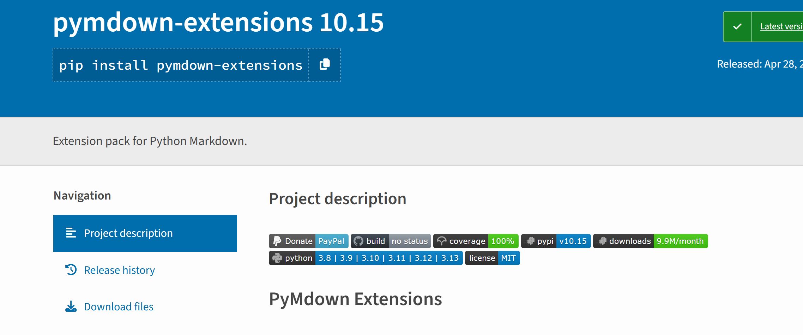

[TOC]

---

## Markdown Overview

> Markdown is a lightweight markup language that allows people to write documents using a plain text format that is easy to read and write, and then convert them into richly formatted HTML pages. — [Wikipedia](https://en.wikipedia.org/wiki/Markdown)


## Main Features

### 1. Code Blocks

```python
@requires_authorization
def somefunc(param1='', param2=0):
    '''A docstring'''
    if param1 > param2: # interesting
        print 'Greater'
    return (param2 - param1 + 1) or None

class SomeClass:
    pass


if __name__ == '__main__':
    print 'hello world'
```

Inline code: `pip install md2html-python`

### 2. LaTeX Formulas

You can create inline formulas, for example:$\Gamma(n) = (n-1)!\quad\forall n\in\mathbb N$.

Or block-level formulas:  
$$
x = \dfrac{-b \pm \sqrt{b^2 - 4ac}}{2a}
$$

### 3. Tables

| Item      |    Value | Qty  |
| :-------- | --------:| :--: |
| Computer  | 1600 USD |  5   |
| Phone     |   12 USD |  12  |
| Pipe      |    1 USD | 234  |

### 4. Flowcharts


### 5. Checkboxes

Use `- [ ]` and `- [x]` syntax to create checkboxes, useful for todo-lists. For example:

- [x] Completed item  
- [ ] Todo item 1  
- [ ] Todo item 2

### 6. Images



### 7. Blocks

#### Definition

/// define  
Apple

- Pomaceous fruit of plants of the genus *Malus* in  
  the family *Rosaceae*.

///


#### Emoji

:smile: :heart: :thumbsup:


This is a text with link: [Wikipedia](https://en.wikipedia.org/wiki/Markdown)
